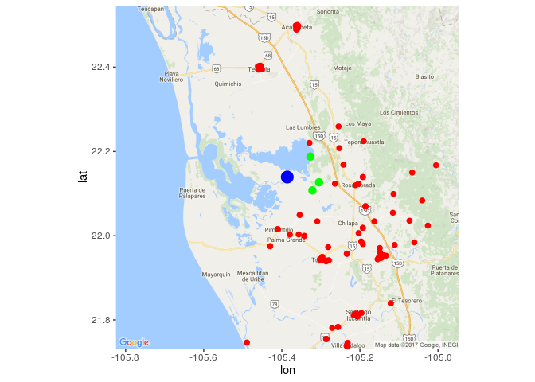

Requerimientos
==============

Se verifica si el equipo en donde se ejecuta el script tiene instalados los paquetes que se utilizarán para el análisis, en caso de no ser así se instalarán.

``` r
setwd("/home/fou/Desktop/vacaciones 2016/datalab ")
packs <- c("XLConnect", "plyr", "stringr", "sp", "spdep", "ggmap" )

for (i in packs)
{

if (!(as.character(i)  %in% rownames(installed.packages()) ))
    {
        tryCatch(install.packages(as.character(i)))    
    }
 
}
lapply(packs, library,  character.only = TRUE)
```

    ## Loading required package: XLConnectJars

    ## XLConnect 0.2-12 by Mirai Solutions GmbH [aut],
    ##   Martin Studer [cre],
    ##   The Apache Software Foundation [ctb, cph] (Apache POI, Apache Commons
    ##     Codec),
    ##   Stephen Colebourne [ctb, cph] (Joda-Time Java library),
    ##   Graph Builder [ctb, cph] (Curvesapi Java library)

    ## http://www.mirai-solutions.com ,
    ## http://miraisolutions.wordpress.com

    ## Loading required package: Matrix

    ## Loading required package: ggplot2

    ## [[1]]
    ## [1] "XLConnect"     "XLConnectJars" "stats"         "graphics"     
    ## [5] "grDevices"     "utils"         "datasets"      "methods"      
    ## [9] "base"         
    ## 
    ## [[2]]
    ##  [1] "plyr"          "XLConnect"     "XLConnectJars" "stats"        
    ##  [5] "graphics"      "grDevices"     "utils"         "datasets"     
    ##  [9] "methods"       "base"         
    ## 
    ## [[3]]
    ##  [1] "stringr"       "plyr"          "XLConnect"     "XLConnectJars"
    ##  [5] "stats"         "graphics"      "grDevices"     "utils"        
    ##  [9] "datasets"      "methods"       "base"         
    ## 
    ## [[4]]
    ##  [1] "sp"            "stringr"       "plyr"          "XLConnect"    
    ##  [5] "XLConnectJars" "stats"         "graphics"      "grDevices"    
    ##  [9] "utils"         "datasets"      "methods"       "base"         
    ## 
    ## [[5]]
    ##  [1] "spdep"         "Matrix"        "sp"            "stringr"      
    ##  [5] "plyr"          "XLConnect"     "XLConnectJars" "stats"        
    ##  [9] "graphics"      "grDevices"     "utils"         "datasets"     
    ## [13] "methods"       "base"         
    ## 
    ## [[6]]
    ##  [1] "ggmap"         "ggplot2"       "spdep"         "Matrix"       
    ##  [5] "sp"            "stringr"       "plyr"          "XLConnect"    
    ##  [9] "XLConnectJars" "stats"         "graphics"      "grDevices"    
    ## [13] "utils"         "datasets"      "methods"       "base"

Limpieza de datos
=================

Se obtienen los datos de las hojas del archivo .xlsx y se forma un solo dataframe con todos ellos, la manera en la que se implemento permite que al archivo original se añadan más hojas sin afectar el script.

``` r
libro <- loadWorkbook("refugios_nayarit.xlsx")
leer <- function( indice)
{
    #el tryCatch verifica que el indice dado en verdad sea un numero de hoja 
    tryCatch(readWorksheet(libro, sheet = indice, startRow = 7, header =FALSE ),
             error = function (x) data.frame())
}
b <- lapply(1:100,leer)
datos <- ldply(b, rbind) 
colnames(datos) <- c('No', 'Refugio', 'Municipio', 'Dirección', 'Uso_del_inmueble', 'Servicios',
                     'Capacidad_de_personas', 'Latitud', 'Longitud', 'Altitud',
                     'Responsable', 'Telefono')  

datos <- datos[!is.na(datos['Refugio']),] #limpiar los reglones que tienen 
                                           #"sumas" en las hojas del excel
```

Se detectó que existen centros de acopio de los cuales no se capturó su localización, estos registros se omiten debido a que no aportan información para que el ciudadano encuentre el más cercano a su localización. Si bien esta esta no es la mejor solución y puede mejorarse con la información de los municipios.

``` r
###/*filtrar desconocidos
datos <- datos[ !is.na(datos$Latitud), ]
datos <- datos[ !is.na(datos$Longitud), ]
```

Se hizo uso de expresiones regulares para transformar las coordenadas capturadas de los centros de acopio debido a que el formato de captura no es único.

``` r
ParserLatitud<-function(x)
{
    grados <- str_extract(x, "^[0-9]*")
    marca <- str_locate(x,"[ºª|°]")
    minutos <- substr(x, start = marca +1  , stop = marca + 2 )
    marca2 <- str_locate(x,"[\\.-]")
    segundos <- substr(x, start = marca2 - 2 , stop = marca2 - 1   )
    #return ( paste(grados, minutos, segundos)   )
    return ( as.numeric(grados) + as.numeric(minutos)/60 + as.numeric(segundos)/3600)
}
ParserLongitud<-function(x)
{
    grados <- str_extract(x, "^[0-9]*[ºª°|]")
    grados <- str_extract(grados,"[0-9]*")
    marca <- str_locate(x,"[ºª°|]")
    minutos <- substr(x, start = marca +1  , stop = marca + 2 )
    marca2 <- str_locate(x,"[\\.-]")
    segundos <- substr(x, start = marca2 - 2 , stop = marca2 - 1   )
    #return ( paste(grados, minutos, segundos)   )
    return ( as.numeric(grados) + as.numeric(minutos)/60 + as.numeric(segundos)/3600)
    
}

coord<-( unlist( Map( ParserLatitud, datos$Latitud ) ) )
coord<-cbind(coord, ( unlist( Map( ParserLongitud, datos$Longitud ) ) ) )
rownames(coord)<-1:dim(coord)[1]
```

Se identificaron algunos registros en los cuales las coordenadas no reportan grados solo minutos y segundos, los cuales se descartaron, también un registro cuyas coordenadas (latitud y longitud) se capturaron en orden inverso.

``` r
coord <- coord[ !is.na(coord[,1]), ]
coord <- coord[ !is.na(coord[,2]), ]
coord <-coord[-which.max(coord[,1]), ]  #en particular esta creo que esta mal capturada
coord<- as.data.frame(coord)
colnames(coord) <- c("lat", "lon")
coord$lon <- -coord$lon
datos <- datos [ as.numeric(rownames(coord)), ]
coo<-SpatialPoints(coord)
```

Se identificó la necesidad de obtener la ubicación del ciudadano quien solicita la información de los centros de acopio más cercanos. Lo plasme como una función “LeerPunto” la cual en los archivos .pdf y .Rmd solo inicializa un objeto con las coordenadas deseadas.

``` r
LeerPunto<-function()
{
    print("Altitud")
    #a<-scan()
    a <- 4 
    #Validar que sea este en Nayarit
    lon<-5
    #while(lon>0)
    #{
    #    print("Longitud (aprox. -105)  ")
        #lon<-scan()
        lon <- sample(coord$lon,1)
    #}
    lat<--4
    #while(lat<0)
    #{
    #    print("Lat")
        #lat<-scan()
        lat <- sample(coord$lat,1)
    #}
    
    return (data.frame(lon = lon, lat = lat))
}

persona<-LeerPunto()
```

    ## [1] "Altitud"

Análisis de los datos
=====================

El análisis de los datos consiste en emplear el algoritmo “k nearest neighbor” tomando como conjunto de entrenamiento a todos los centros de acopio de los que sí se conoce su ubicación para recomendarlos al ciudadano. Se optó por utilizar la implementación “knearneigh” (del algoritmo “k nearest neighbor” de la librería “spdep”) debido a que se decidió trabajar con las coordenadas “Longitud” y “Latitud” y esta implementación ya contempla una métrica diferente a la euclidiana al realizar los cálculos, y este factor es muy importante por la naturaleza espacial de los datos.

``` r
x<-rbind(coord,persona)
xx<- SpatialPoints(x)

recomendaciones <-  knearneigh(xx, k = 3)$nn[dim(x)[1],]
```

Los centros de acopio recomendados para el ciudadano son :

``` r
datos[recomendaciones, c( 'Refugio', 'Municipio', 'Dirección', 'Latitud', 'Longitud', 'Altitud',
                     'Responsable', 'Telefono') ]
```

    ##                                    Refugio Municipio      Dirección
    ## 135 ESCUELA PRIMARIA “FRANCISCO I. MADERO”  SAN BLAS ISLA DEL CONDE
    ## 136 ESC. PRIMARIA “FELIPE CARRILLO PUERTO”  SAN BLAS  PLAYA RAMIREZ
    ## 156                       ESCUELA PRIMARIA  SAN BLAS     LA CHIRIPA
    ##          Latitud      Longitud Altitud          Responsable
    ## 135 21º39'46.24" 105º21'42.62"      10 DIRECTOR DEL PLANTEL
    ## 136 21º40'05.86" 105º21'32.22"      10 DIRECTOR DEL PLANTEL
    ## 156 21º37'31.56" 105º18'43.66"      10 DIRECTOR DEL PLANTEL
    ##                                              Telefono
    ## 135 323-2370220                           323-2370584
    ## 136                                       323-2370147
    ## 156        PCM: 323-2850302       CEL. 045323-1050294

Visualización
=============

El punto azul indica la posición del ciudadano, los verdes los centros de acopio más cercanos y los rojos los otros centros de acopio.

``` r
mapa <- ggmap(get_map(location=c(persona$lon[1], persona$lat[1]) , 
                      maptype = "roadmap", zoom = 10 ))
```

    ## Map from URL : http://maps.googleapis.com/maps/api/staticmap?center=21.647222,-105.335278&zoom=10&size=640x640&scale=2&maptype=roadmap&language=en-EN&sensor=false

``` r
mapa <-mapa  + geom_point(data=persona, aes(lon, lat), color = "blue", size= 5)
res <- data.frame(lat = coord$lat[recomendaciones], lon = coord$lon[recomendaciones])
save(persona,res, coord, file = "mapaReproducible.Rdata" ) # se agrega linea para                                           #guardar .Rdata con los datos necesarios
                                    # para replicar mapa con leaflet

mapa <- mapa + geom_point(data=coord, aes(lon, lat), color = "red", size= 2)
mapa+geom_point(data=res, aes(lon, lat), color = "green", size= 3)
```


